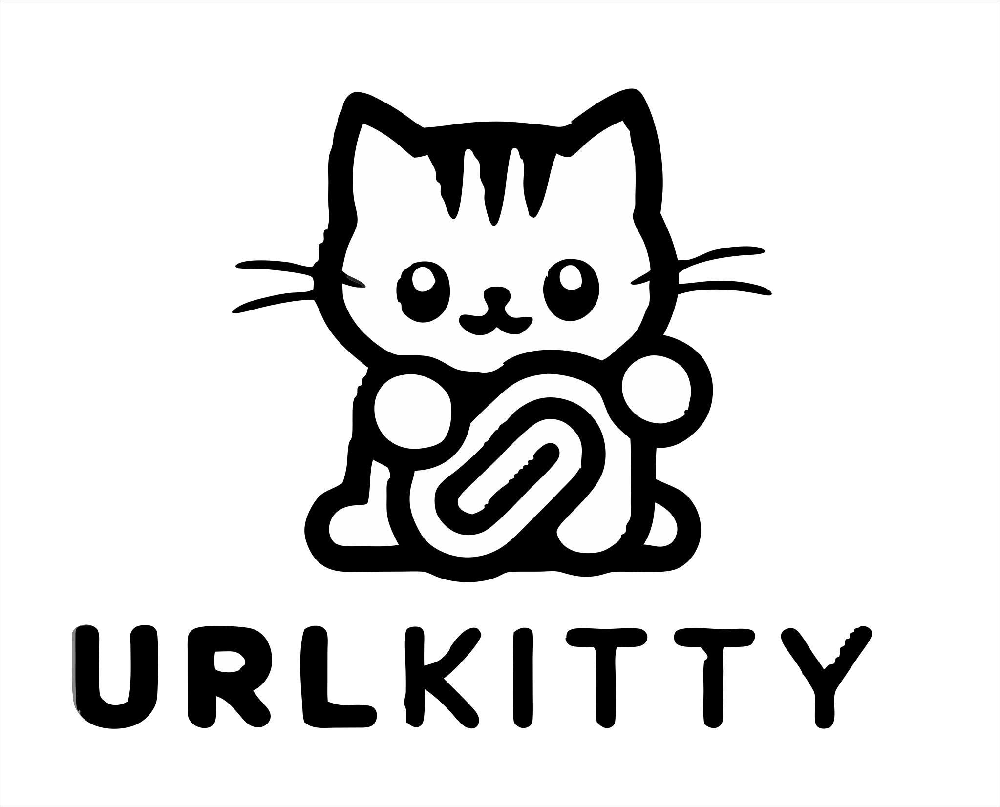
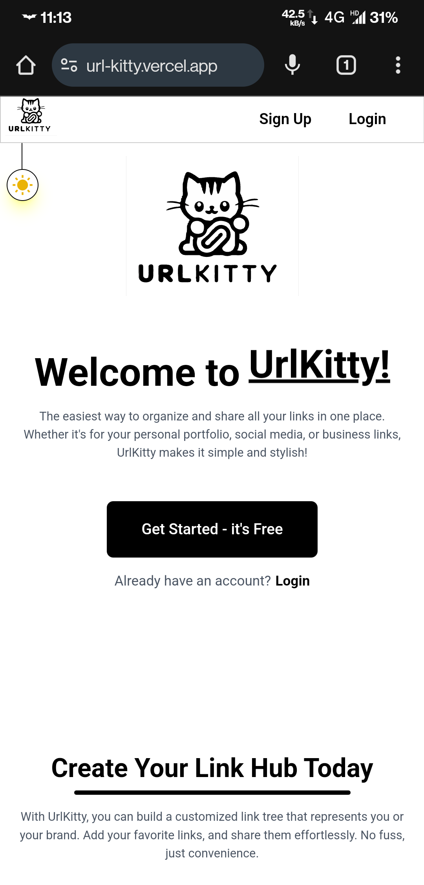
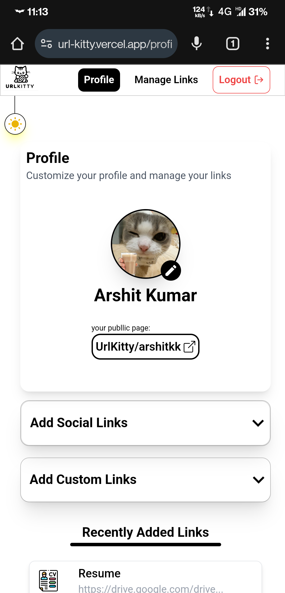
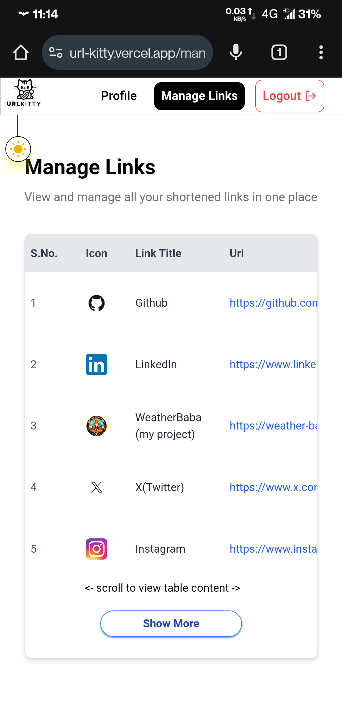
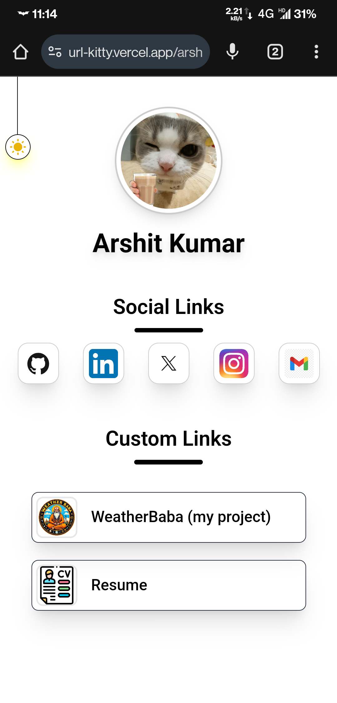
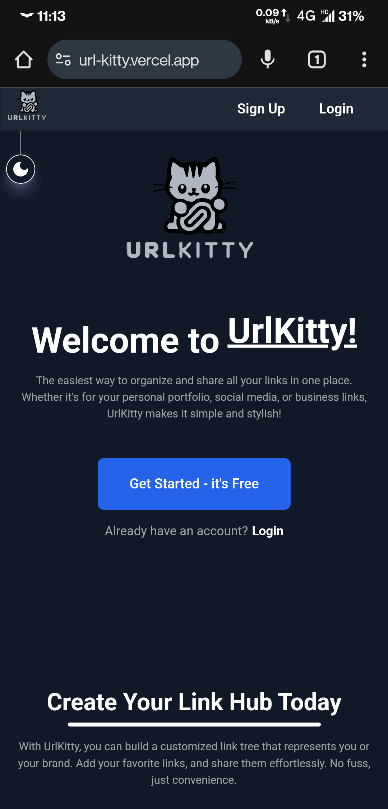
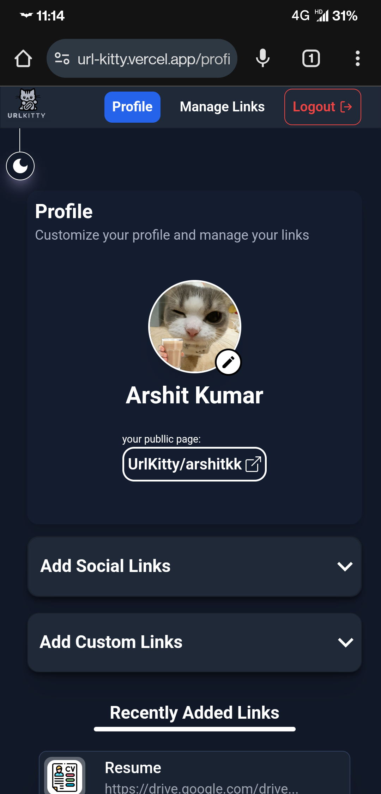
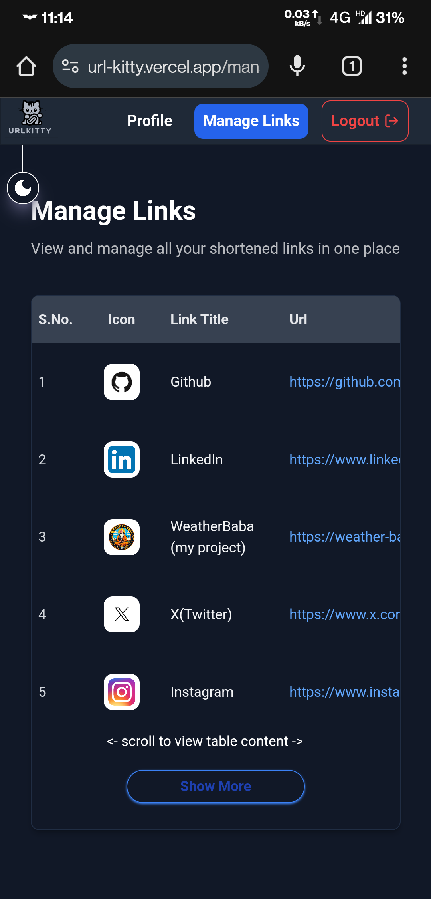
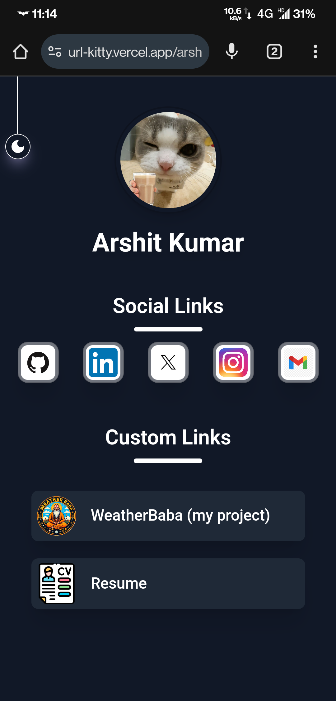

# URL Kitty 🐾

##### Your Personalized Link Hub – Simple, Sleek, and Free!

---

## 🚀 Overview

**URL Kitty** is a customizable link management tool designed to help you create a personalized hub for all your important links. Perfect for creators, professionals, and businesses to organize and share links in one place – think of it as your own stylish "link in bio" page!

---

## ✨ Features

- **Social & Custom Links** – Automatically fetch icons for social media or add your own custom links with personalized titles and icons.
- **Light/Dark Mode** – Toggle between light and dark themes for a tailored experience.
- **Responsive Design** – Flawlessly adapts to mobile, tablet, and desktop screens.
- **User Authentication** – Secure login and data storage powered by Supabase.
- **Simple & Minimalist UI** – Clean interface designed for ease of use.

---

## 📸 Screenshots

### 🌞 Light Mode

**<u>Desktop View:</u>**

<div>
  
  
  
  
</div>

**<u>Mobile View:</u>**

<div>
  
  
  
  
</div>

---

### 🌙 Dark Mode

**<u>Desktop View:</u>**

<div>
  
  
  
  

</div>

**<u>Mobile View:</u>**

<div>
   `
   
   
   
 </div>

## 🛠️ Technologies Used

- **Frontend** – ReactJS, Tailwind CSS, React Router, React Hook Form
- **Backend** – Supabase (Authentication & Database)
- **Deployment** – Vercel

## 📂 Installation

```bash
git clone https://github.com/yourusername/url-kitty.git
cd url-kitty
npm install
npm run dev

```

---

## 📡 Live Demo

👉 [URL Kitty Live](https://url-kitty.vercel.app/)

---

## 🐾 A Little Note...

URL Kitty is a small side project I.ve Created – it’s free and open source (like a stray cat but cuter). 😿  
I don’t have a domain yet because....... i'm broke. If this project attracts some curious cats (aka active users), I might upgrade it!

🔧 Found a bug or have a purr-fect feature idea?

- **Techies** – Head over to GitHub and raise an issue (no hairballs, I promise).
- **Everyone Else** – Email me at [your-email@example.com].


---
###### Thank you so much  for reading this, please checkout this project &  give a star if you liked it
--- 
